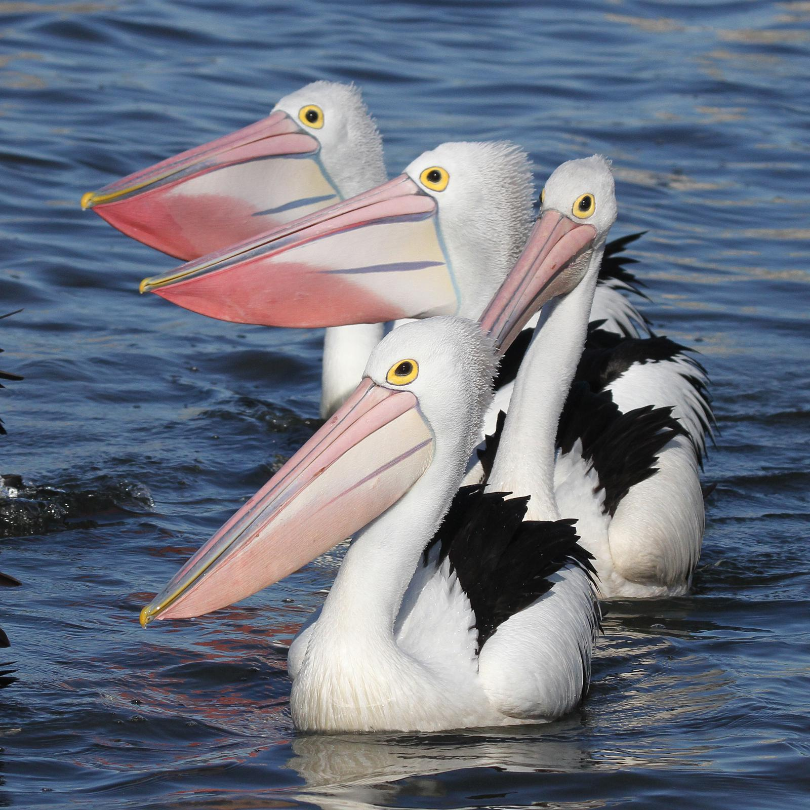

```{r setup, include=FALSE}
knitr::opts_chunk$set(echo = TRUE)
```
# Intro
Notes to introduce the question and detail the hypotheses being tested (1-2 paragraphs)

# Methods: R
Notes and code to load any R packages that you will require
```{r load-libraries}
library(ggplot2)
library(dplyr)
library(tidyverse)
library(pwr)
library(kableExtra) #table layouts
```
# Methods: code
Notes and code to import the data set and extract relevant parts
Q: Which wetlands have the most survey data available?  Make a table of the top 10 wetlands by number of observations.
```{r load-data}
bird <- read.csv(file = "data/Waterbird.csv", header = T)

top_observations <- bird %>%
  count(Wetland) %>% #count the number of observations for each wetland
  arrange(desc(n)) %>% #arrange with highest numbers at top
  filter(Wetland != "Unnamed Wetlands") %>% #take out misc values
  top_n(10) %>% #limit to 10 entries
  kable("html", #clean up the table
  col.names = c("Wetland", "Observations"), #rename columns
  caption = "Top wetlands by # of observations") %>% #table title
  kable_styling(bootstrap_options="condensed", position="left") #text positions

top_observations

```
```{r lake moondarra, fig.cap="Lake Moondarra. Source: outbackqueensland.com.au", out.width = '100%'}

```
# Results: Bird abundance in one year
Q: Which birds are most abundant in a single survey? Choose any one of these wetlands, summarise the number of birds seen for each species in a single year. Notes and code to create a graph that can visualise how the data addresses the questions.

```{r bird-abundance}

moon16 <- bird %>% #read in main df
  filter(Wetland == "Lake Moondarra" & Year == 2016) %>% #filter for target wetland & year
  group_by(Common.Name) %>% #group by species
  summarise(sum=sum(Bird.Count)) #find sum of each species during target year
  
  

plot16 <- moon16 %>% #read in target wetland/year df
  mutate(Species=as.factor(Common.Name), #rename column
  Species=fct_reorder( Species, sum, .desc=F)) %>% #re-order species by sum
  dplyr::select(-Common.Name) %>% #remove duplicate column
  ggplot( aes(y=Species, x=sum)) + #call main plot
  geom_linerange( aes(xmin=0, xmax=sum, y=Species, colour=Species), #create line element
                  show.legend=F) + #remove redundant legend
  geom_point( aes(colour=Species), position=position_dodge(.5), size=2, show.legend=F) +
  geom_text(aes(label = sum), nudge_x = 10) + #add text for sum for clarity
  labs(title="Bird observations in Lake Moondarra",
       subtitle="Total count per species in 2016",
       x="Observations", y="Bird Species") +
  theme_minimal()

plot16
```
# Stats:
Notes to describe the analytical methods (1-2 paragraphs)
Q: Has the abundance of waterbirds declined across the years surveyed? For your chosen wetland, contrast total abundance of all species with year of the survey. 
```{r population}
#find the total abundance of birds per year at Lake Moondarra
moon_total <- bird %>%
  filter(Wetland == "Lake Moondarra") %>%
  group_by(Year) %>%
  summarise(sum=sum(Bird.Count))

#find equation for the regression line
moon.lm <- lm(sum ~ Year, #sum predicted by year
              data = moon_total)
summary(moon.lm)

#plot the line of best fit
ggplot(moon_total, aes(Year,sum)) + 
  geom_point() + 
  geom_smooth(method="lm")
```

Q: Is there evidence of a decline in abundance for a single species at a chosen wetland. Choose just one birds species to analyse.
```{r cute-pelicans, fig.cap="Pelicans. Source: centralcoast.nsw.govt.au"}

```


```{r pelican-decline}

pel_abund <- bird %>%
  filter(Wetland == "Lake Moondarra" & Common.Name=="Pelican") %>%
  group_by(Year) %>%
  summarise(sum=sum(Bird.Count))


ggplot(pel_abund, aes(x=Year, y=sum)) +
  geom_point() + geom_smooth(method="lm")

pel.lm <- lm(sum~Year, data=pel_abund)
summary(pel.lm)

```

```{r anova-moondarra}
# moon_species <- bird %>%
#   filter(Wetland == "Lake Moondarra") %>%
#   group_by(Year, Common.Name) %>%
#   summarise(sum=sum(Bird.Count))
# 
# moon.aov <- aov(sum ~ Year * Common.Name, data = moon_species)
# summary(moon.aov)
```


There is evidence that pelican species are experiencing more of a decline than bird species as a whole at Lake Moondarra.
# Discussion:
Notes to interpret the results (1-2 paragraphs)

Marking: 
a)Notes to introduce the question and detail the hypotheses being tested (10marks)
b)Notes and code to load any R packages that you will require (5 marks)
c)Notes and code to import the data set (5 marks)
d)Notes and code to create a graph that can visualise how the data addresses the question (25 marks)
e)Notes to describe the analytical methods (15 marks)
f)Code to formally analyse the data to address the question (25 marks)
g)Notes to interpret the results (15 marks)
